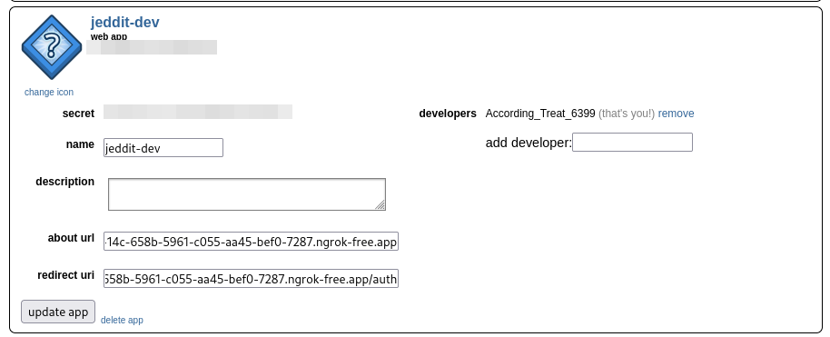

[Screencast from 2023-08-31 16-31-14.webm](https://github.com/Jackevansevo/jeddit/assets/4996338/9ffbbec7-25af-47c1-b1f5-4a194576663b)

# Local Development

In a virtualenv

    pip install pip-tools

    pip-sync requirements.txt dev-requirements.txt

Read the documentation: https://github.com/reddit-archive/reddit/wiki/OAuth2 to
acquiring a `CLIENT_ID` and `CLIENT_SECRET`

I use ngrok when running locally, ngrok gives me a publicly addressable URL,
which I configure as my applications redirect uri in
https://www.reddit.com/prefs/apps

    ngrok http 8000

The application expects the following secrets to be present in an .env file:

    CLIENT_ID=<CLIENT_ID>
    CLIENT_SECRET=<CLIENT_SECRET>
    REDIRECT_URI=<NGROK_URL>/auth

Run the app with: 

    uvicorn app:app --reload

    npx tailwindcss -i ./input.css -o ./static/output.css --watch

# Deploying with fly.io

    fly launch

    fly secrets set CLIENT_ID=<CLIENT_ID>
    fly secrets set CLIENT_SECRET=<CLIENT_SECRET>
    fly secrets set REDIRECT_URI=<APP_URL>/auth

    fly deploy
